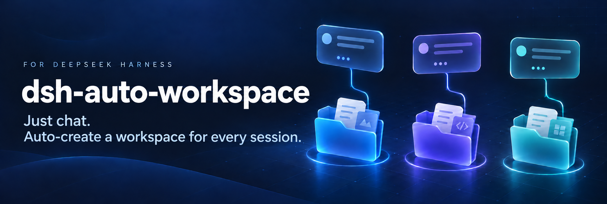

# dsh-auto-workspace

[English](README.md) | [简体中文](README.zh-CN.md)

DeepSeek Harness 的 Codex 式**无项目聊天**。

点「新会话」而不选项目，直接就能开始打字。插件会给这个会话一个独立的本地工作目录，Agent
的文件工具和 shell 命令都在里面执行；下次回到这个会话，它仍然在同一个目录里工作。侧栏的
项目列表不会因此多出任何东西。

## 它改了什么

DSH 只在一个地方决定会话的工作目录：

```js
// @deepseek-ai/dsh-api-session-controller
const cwd = workspace?.path ?? request.cwd ?? this.defaultCwd
```

`this.defaultCwd` 就是 Host 进程自己的 `process.cwd()`。GUI 永远会带上 `workspaceId`，所以
这条兜底平时不会触发 —— 但原生根本没有「不选项目」这个选项，而任何其它入口只要不指定项目，
就会静默继承 DSH 启动时所在的目录。

这个插件只接管这一条兜底，别的一概不动。

| | |
|---|---|
| **目录** | `~/Documents/DSH/<YYYY-MM-DD>/chat-NN/`（Windows 上是 `%USERPROFILE%\Documents\DSH`） |
| **分组** | 会话不会进入项目列表；DSH 把它们归在自己原生的「未分组」分组下 |
| **恢复** | 目录写在会话自己的 `cwd` header 里，重新打开这个会话就复用原目录，文件全部保留 |
| **继承** | 显式指定的项目优先。在项目里点「新会话」仍在那个项目；在无项目会话里点，保持无项目 |
| **入口** | 悬浮在新建会话 Hero 的项目 chip 上时，它的文件夹图标会换成一个圆形清除徽标 —— 点它即离开项目。选择器菜单里另有一行「不在工作区中工作」。未选择项目时 chip 显示「选择工作区」，也不出现徽标 |
| **新建会话界面** | 无项目会话保留 DSH 原生的「尚未开始」Hero —— 鱼标、标题、chip 行、agent preset 控件 —— 因为有一个仅存在于浏览器端的哨兵工作区为输入框提供标题 |
| **清理** | 不删除任何东西。只有会话创建失败、且目录还是空的时候，才会回收那个目录 |

## 安装

这个包是一个 DSH **bundle**：`package.json` 里声明了 `dsh.bundle.patch`，所以安装它会把该
bundle 追加到 profile 的 `dsh.profile.bundles`，并激活它的加载行。

Web 端使用以下命令安装：

```bash
dsh plugin --profile web add github:Castor6/dsh-auto-workspace
```

桌面端不支持通过命令行安装。请从左侧导航栏进入**插件**，输入
`github:Castor6/dsh-auto-workspace` 或仓库地址
`https://github.com/Castor6/dsh-auto-workspace`
进行安装。

## 配置

在 profile patch（`~/.dsh/profiles/<profile>/cordis.patch.yml`）里该插件的加载行上设置：

```yaml
- id: auto-workspace
  config:
    root: '/Volumes/Work/DSH'   # 默认：<home>/Documents/DSH
    directoryPrefix: 'chat'     # 默认：chat  →  chat-01, chat-02, ...
    enabled: true               # 默认：true
```

`<root>/.dsh-auto-workspace.json` 记录「会话 → 目录」的映射。它只是一层缓存：删掉它，插件会
从每个会话自己持久化的 header 重建。删掉整个 root 就等于删掉所有无项目聊天的文件。

## 实现原理

**Host 端**（`lib/index.js`，只 import Node 内建模块 —— 用 `link:` 方式安装的插件是按真实路径
加载的，那里没有 `node_modules`）：

- 包装 `ctx.sessionController.create`。带了 `workspaceId` 或显式 `cwd` 的请求原样放行；两者
  都没有的请求，才会从分配器拿到一个目录。用不带 `recursive` 的 `mkdir` 作为原子占位，所以
  并发创建也不会撞名。
- `SessionHeader.cwd` 一旦写入就不可变，所以目录名只定一次、永不改名 —— 这也是为什么「日期
  目录 + `chat-NN`」在创建时就固定下来。
- 恢复以持久化的 header 为准：`resumeObserved` 读 `header.cwd`，没有就直接拒绝。所以在创建
  时把目录注入进去，才是无项目聊天能够持久化的关键。

**浏览器端**（`lib/client.js`，手写的 lazy-CJS bundle —— 无需构建；`react`、`react-dom` 和
`@deepseek-ai/dsh-client-ui-primitives` 都是 shell 提供的 seed 模块）：

- 以 `priority: -1` 占用 `conversation.hero.workspace`，把原生选择器从这个 `single` 座位上
  影子掉（默认优先级是 0）。项目列表、选中态勾选、文件夹错误弹窗都原样保留。
- 增加清除徽标。项目 chip 是 shell 渲染的、没有对应插槽，所以徽标是在悬浮时**替换** chip 的
  文件夹图标：一个文档级指针监听**结构化地**找到这个 chip —— 它是本插件自己的插槽锚点紧邻的
  前一个兄弟节点，而框架把该锚点渲染成带 `display: contents` 的
  `div[data-slot="conversation.hero.workspace"]` —— 然后把原图标隐藏，并在它实测出来的矩形上
  居中叠一个徽标；徽标画得比图标包围盒小，因为实心圆看起来比它替换掉的线性图标更重。这里
  不依赖任何文案，所以中英切换也不受影响。选择器的 footer 里「添加文件夹」旁边多了一行
  「不在工作区中工作」。未选择项目时这两个入口都不出现；万一 chip 定位不到，就退化成 chip
  左边一个内联徽标。
- 采纳文件夹走的是 `ctx.uiWorkspace.pickDirectory()` —— 正是原生 `…directoryFlow` 占用者最终
  调用的东西。这一步没法委托给那个洞：插槽占用者只能渲染它自己声明过的子插槽，而一个子插槽
  名只能被声明一次，所以影子占用者永远渲染不了原生注册声明过的洞。
- **用一个哨兵工作区把 Hero 留住。** 原生 DSH 只给「属于某个工作区」的会话提供可用输入框：
  `ConversationMainPanel` 在 `chipTitle === undefined` 时禁用它，而 `chipTitle` 只可能来自
  工作区标题。把会话挂到一个真工作区上，正是本插件不能创建的侧栏项目，而且还会把聊天从
  「未分组」里搬走。所以浏览器端的投影追加一个**哨兵工作区** —— 只存在于客户端、从不注册到
  Host、不承载任何会话 —— 再由 Hero 自己的选择器回调把它选中，`chipTitle` 就有了值。它**只在
  主会话是无项目时**才出现在投影里，所以一旦导航到项目会话它就会消失，面板自己会把过期的选中
  态清掉。
  这个哨兵不可避免地会进入侧栏的分组列表（该列表会为每个工作区渲染一行，空工作区也不例外）；
  那一行用一个监听 DOM 变化的 `display: none` 藏掉。
- **兜底：改用快照覆盖。** 如果哨兵装不上（比如那个 store 不可写），插件会自己发现，转而通过
  每个会话自己的 shell 快照，把无项目会话报告成「有内容」（`blank: false,
  awaitingFirstTurn: false`），于是渲染成普通的活跃会话输入框。聊天依然可用，只是丢掉 Hero。
  这条路径只动那一个快照 —— 会话**列表**里的真实 blank 原样保留，所以侧栏可见性、原生空白会话
  复用、以及本插件自己的复用都维持原生行为。
- 包装 `ctx.uiWorkspace.startSession`，让当前是无项目会话时继续无项目，而不是跳到最近活跃的
  项目。
- 给「未分组」分组标题上那个新建会话按钮搭了个桥。原生 DSH 会把它渲染出来，但处理函数是
  `if (group.workspaceId !== void 0)`，而这个分组没有工作区 id，所以它是个死按钮。分组标题
  内部没有插槽可占，而替换 `sidebar.workspaces` 等于把整个侧栏浏览器重写一遍；这里改用捕获
  阶段的监听，按同一个 locale 服务产出的无障碍名匹配那个按钮。文案改名或标题结构变化时它就
  不再匹配，原生行为自然回归。

## 已知限制

- Host 包装和客户端补丁伸进了包的内部实现（`sessionController.create`、
  `uiWorkspace.startSession`、`sessions.binding` 的快照 store），而不是公开扩展点。它们都是
  防御性写法：形状一变，插件打一条 warning 并保持惰性，而不是把应用弄坏。
- Hero 选择器的占用者影子掉了原生 UI。DSH 若重新设计这个选择器，需要重新核验本插件。
- `chat-NN` 的序号是按天、尽力而为的：删掉某天的目录会让序号可被复用，所以序号在时间上不单调。
- 无项目会话出现在 DSH 原生的「未分组」分组下。它们从不被注册成项目。
- 哨兵工作区是通过「标签文本 + 容器类名后缀 `groupSection`」从侧栏里藏掉的。如果 DSH 的改版
  破坏了其中任何一条，侧栏会多出一行标题为「选择工作区」的空项目行 —— 纯粹是外观问题。把
  `lib/client.js` 顶部的 `HERO_FOR_PROJECT_LESS` 改成 `false` 就能彻底去掉哨兵、回到快照覆盖
  方案；客户端 bundle 每次加载页面都会重新读取，刷新一次即生效。
